# Master System Architecture: Distributed In-Memory Acceleration Layer

## 1. Guiding Principles for Revision

This architecture document presents a revised, simplified design for the Master component. The primary goals of this revision are to reduce complexity, eliminate premature generalization, and improve developer productivity by adhering to the YAGNI ("You Ain't Gonna Need It") principle.

The key changes focus on:
- **Module Consolidation:** Grouping closely related functions into more cohesive packages to reduce fragmentation and boilerplate.
- **Abstraction Simplification:** Retaining only the interfaces that provide immediate, clear value for extension or decoupling, and favoring concrete implementations for other functionalities.

## 2. Overall Architecture Diagram

```mermaid
graph TB
    %% External Layer - Clients
    subgraph External["🌐 External Systems & Clients"]
        direction LR
        Admin["👤 Admin/Controller<br/>Management Interface"]
        BI["📊 BI Tools<br/>Query Clients"]
    end

    %% Application Layer - Gateway
    subgraph AppLayer["📡 Application Layer - Query Gateway"]
        direction LR
        Gateway["Data Gateway<br/>• Query Routing<br/>• Load Balancing<br/>• Failover"]
    end

    %% Control Plane - Master Cluster
    subgraph ControlPlane["🎯 Control Plane - Master Cluster"]
        direction TB
        
        subgraph MasterNodes["Master Nodes (HA Cluster)"]
            direction LR
            M1["Master-1<br/>Follower"]
            M2["Master-2<br/>⭐ Leader"]
            M3["Master-3<br/>Follower"]
        end
        
        subgraph MasterComponents["Leader Components"]
            direction TB
            
            subgraph API["gRPC API Layer"]
                MgmtAPI["ManagementService<br/>• AdmitDataset<br/>• ListDatasets"]
                CtrlAPI["ControlPlaneService<br/>• EventStream<br/>• Worker Coordination"]
            end
            
            subgraph CoreLogic["Core Business Logic"]
                Admission["Admission Controller<br/>• Request Validation<br/>• Source Interrogation<br/>• LoadPlan Generation<br/>• Quota Enforcement"]
                Assignment["Assignment Manager<br/>• Worker Selection<br/>• Load Balancing<br/>• Rebalancing"]
                Cluster["Cluster Manager<br/>• Worker Liveness<br/>• Health Monitoring<br/>• Failover Detection"]
            end
            
            API --> CoreLogic
        end
        
        subgraph StateStore["Distributed State Store"]
            Etcd["etcd Cluster<br/>• Leader Election (RAFT)<br/>• Worker Registry<br/>• Assignment State<br/>• Tenant Config<br/>• Global Config"]
        end
        
        MasterNodes --> StateStore
        CoreLogic --> StateStore
    end

    %% Data Plane - Workers
    subgraph DataPlane["⚡ Data Plane - Worker Cluster"]
        direction TB
        
        subgraph TenantA["Tenant A Workers"]
            direction LR
            W1["Worker-1<br/>🔷 DuckDB Engine<br/>📦 Epoch Cache<br/>💾 In-Memory Data"]
            W2["Worker-2<br/>🔷 DuckDB Engine<br/>📦 Epoch Cache<br/>💾 In-Memory Data"]
        end
        
        subgraph TenantB["Tenant B Workers"]
            direction LR
            W3["Worker-3<br/>🔷 DuckDB Engine<br/>📦 Epoch Cache<br/>💾 In-Memory Data"]
            W4["Worker-N<br/>🔷 DuckDB Engine<br/>📦 Epoch Cache<br/>💾 In-Memory Data"]
        end
    end

    %% Infrastructure Layer - Data Sources
    subgraph Infrastructure["🗄️ Infrastructure Layer - Data Sources"]
        direction LR
        
        subgraph Lakehouse["Data Lakehouse"]
            Iceberg["Apache Iceberg<br/>• Table Format<br/>• Metadata Catalog<br/>• Snapshot Management"]
        end
        
        subgraph OLAP["OLAP Systems"]
            StarRocks["StarRocks<br/>• Analytical Engine<br/>• Query Processing<br/>• Data Snapshots"]
        end
    end

    %% Connections - Control Flow
    Admin -->|"1. AdmitDataset RPC"| MgmtAPI
    MgmtAPI --> Admission
    Admission -->|"2. Resolve Metadata"| Iceberg
    Admission -->|"2. Resolve Metadata"| StarRocks
    Admission --> Assignment
    Assignment -->|"3. Persist Assignment"| Etcd
    
    %% Connections - Worker Management
    CtrlAPI <-->|"4. Bi-directional Stream<br/>Register/Heartbeat/Assignment"| W1
    CtrlAPI <-->|"4. Bi-directional Stream<br/>Register/Heartbeat/Assignment"| W2
    CtrlAPI <-->|"4. Bi-directional Stream<br/>Register/Heartbeat/Assignment"| W3
    CtrlAPI <-->|"4. Bi-directional Stream<br/>Register/Heartbeat/Assignment"| W4
    
    Cluster -->|"5. Monitor Leases"| Etcd
    
    %% Connections - Data Pull
    W1 -.->|"6. Pull Data Files"| Iceberg
    W2 -.->|"6. Pull Data Files"| Iceberg
    W3 -.->|"6. Pull Query Results"| StarRocks
    W4 -.->|"6. Pull Query Results"| StarRocks
    
    %% Connections - Query Flow
    BI -->|"7. Query Request"| Gateway
    Gateway -->|"8. Lookup Assignment"| Etcd
    Gateway -->|"9. Route Query"| W1
    Gateway -->|"9. Route Query"| W2
    Gateway -->|"9. Route Query"| W3
    Gateway -->|"9. Route Query"| W4

    %% Styling for Dark Mode - High Contrast
    classDef external fill:#4a5568,stroke:#e2e8f0,stroke-width:3px,color:#f7fafc
    classDef appLayer fill:#2d3748,stroke:#90cdf4,stroke-width:3px,color:#e6fffa
    classDef controlPlane fill:#1a365d,stroke:#63b3ed,stroke-width:3px,color:#bee3f8
    classDef masterNode fill:#2c5282,stroke:#90cdf4,stroke-width:2px,color:#e6fffa
    classDef api fill:#2a4365,stroke:#4299e1,stroke-width:2px,color:#bee3f8
    classDef logic fill:#1e4e8c,stroke:#4299e1,stroke-width:2px,color:#bee3f8
    classDef state fill:#234e52,stroke:#4fd1c5,stroke-width:3px,color:#b2f5ea
    classDef dataPlane fill:#22543d,stroke:#68d391,stroke-width:3px,color:#c6f6d5
    classDef worker fill:#276749,stroke:#68d391,stroke-width:2px,color:#c6f6d5
    classDef infrastructure fill:#742a2a,stroke:#fc8181,stroke-width:3px,color:#fed7d7
    classDef dataSource fill:#9b2c2c,stroke:#fc8181,stroke-width:2px,color:#fed7d7

    class External external
    class AppLayer,Gateway appLayer
    class ControlPlane,MasterNodes,MasterComponents,API,CoreLogic controlPlane
    class M1,M2,M3 masterNode
    class MgmtAPI,CtrlAPI api
    class Admission,Assignment,Cluster logic
    class StateStore,Etcd state
    class DataPlane,TenantA,TenantB dataPlane
    class W1,W2,W3,W4 worker
    class Infrastructure,Lakehouse,OLAP infrastructure
    class Iceberg,StarRocks dataSource
```



## 3. Overall Architecture

The Master is the central coordination component of the distributed, memory-centric acceleration layer. It acts as a stateful control plane, orchestrating data placement and lifecycle across a cluster of Worker nodes without managing the data itself. By leveraging a distributed consensus store (etcd), it maintains the global state of the cluster, including worker status and data assignments. Its primary role is to ensure that hot data from the underlying data lakehouse (e.g., Iceberg tables, OLAP snapshots) is available in memory on the correct Workers, ready to be queried with low latency via the Data Gateway.

The system follows a **master-worker** architecture where the Master is the brain and the Workers are the high-performance data engines. The data onboarding and assignment flow is as follows:

1.  **Admission Request**: An external administrator or service interacts with the Master's `ManagementService` gRPC API to request that a specific dataset be loaded into the speed layer.
2.  **Admission Control**: The Master's internal **Admission Controller** receives this request. It connects to the underlying data source (e.g., Iceberg catalog) to resolve the request into a concrete set of data files, schema, and partition information.
3.  **Load Plan Generation**: The Admission Controller generates a detailed `LoadPlan`. This plan is an explicit, immutable recipe that tells a Worker exactly what data to pull and how to load it.
4.  **Data Assignment**: The Master determines which Worker(s) should handle the `LoadPlan` and persists this assignment in `etcd`.
5.  **Notify & Pull**: The Master sends a `DataAssignmentEvent`, containing the `LoadPlan`, over the persistent gRPC stream to the designated Workers.
6.  **Caching & Serving**: Workers pull the immutable data directly from the source as specified in the `LoadPlan`, load it into their in-memory engine (DuckDB), and report their status as `READY`. The Data Gateway can then route queries for that data epoch.

This architecture treats the in-memory layer as a **CPU cache for the data lakehouse**. It holds the hottest, most frequently accessed data subsets in a high-speed medium (RAM) to accelerate queries, while the larger, colder dataset remains in the lakehouse.

## 4. Master Cluster Management

To ensure high availability and prevent a single point of failure, the Master is deployed as a distributed cluster. It leverages an embedded `etcd` instance for all coordination, state management, and consensus, aligning with Go's principles of simplicity and robust concurrency.

### Master Membership and Leader Election

-   **Membership**: Each Master node registers itself in `etcd` upon startup by creating a key under a well-defined prefix (e.g., `/masters/{master_id}`). This registration includes its gRPC endpoint for intra-cluster communication if needed.
-   **Leader Election**: The cluster elects a single active leader using `etcd`'s built-in election API, which is based on the RAFT consensus algorithm. The leader is responsible for making all critical decisions, such as data assignments and worker notifications. Follower nodes remain on standby, ready to take over if the leader fails. They use `etcd` watches to observe state changes made by the leader and maintain a consistent view.
-   **Failover**: If the leader node fails, its `etcd` session will time out, and its leadership lease will expire. The `etcd` election library ensures that one of the followers will be promptly elected as the new leader, minimizing downtime.

## 5. Worker Status Management

The Master is solely responsible for tracking the health and status of all Worker nodes. Workers are designed to be simple and unaware of `etcd`; they communicate with the Master exclusively via a persistent, bidirectional gRPC stream. This event-driven approach simplifies the communication model and ensures real-time state synchronization.

-   **Connection & Registration**: On startup, a Worker establishes a long-lived gRPC stream to the Master by calling the `EventStream` RPC. The first event it sends on this stream is a `RegisterEvent`. The Master (leader) accepts this event, creates a new lease in `etcd`, associates it with the Worker's key (e.g., `/workers/{tenant_id}/{worker_id}`), and sends back a `RegistrationAckEvent`.
-   **Heartbeat**: The Worker then periodically sends `HeartbeatEvent` messages on the stream to signal its liveness. On receiving a heartbeat, the Master refreshes (keeps alive) the Worker's lease in `etcd`.
-   **Failure Detection**: If the gRPC stream breaks or the Master stops receiving heartbeats within the lease's Time-To-Live (TTL), the lease expires. `etcd` automatically deletes the associated Worker key. The Master uses an `etcd` watch to detect this deletion and marks the Worker as `offline`. This triggers a rebalancing of any data assignments that the failed Worker held.

### Sequence Flow: Worker Event Stream

```text
Worker                  Master (Leader)               etcd
  |                        |                           |
  |--- EventStream() ------>| (Stream Established)      |
  |                        |                           |
  |--- RegisterEvent ------>|                           |
  |                        |-- CreateLease(TTL)  ------>|
  |                        |<-- LeaseID ----------------|
  |                        |-- Put(/workers/{id}, LeaseID) ->|
  |<-- RegistrationAckEvent-|                           |
  |                        |                           |
  | (Periodically)         |                           |
  |--- HeartbeatEvent ---->|                           |
  |                        |-- KeepAlive(LeaseID) ---->|
  |                        |                           |
  | (Stream breaks)        |                           |
  |                        | (Lease expires)           |
  |                        |                           |-- Key /workers/{id} deleted
  |                        |<-- Watch Event -----------|
  |                        |                           |
  |                        | (Mark worker offline,     |
  |                        |  trigger rebalancing)     |
  |                        |                           |
```

## 6. Admission Control and Data Onboarding

The **Admission Controller** is a logical component within the Master responsible for managing the data lifecycle in the speed layer. It acts as the gatekeeper, translating high-level requests into concrete, executable `LoadPlan`s for the workers.

-   **Entry Point**: The controller is exposed via the external `ManagementService` gRPC API. This allows administrators or automated systems to declaratively state which data should be accelerated.
-   **Responsibilities**:
    1.  **Request Validation**: It validates incoming `AdmitDatasetRequest` messages, ensuring the specified tenant and data source are valid.
    2.  **Source Interrogation**: It connects to the external data source (e.g., an Iceberg catalog) to resolve the request. For example, it translates a request for "the last 7 days of the `sales` table" into a specific list of manifest files, data files, and the corresponding table schema for that snapshot.
    3.  **LoadPlan Generation**: It constructs the detailed, immutable `LoadPlan`. This plan contains all the physical information a worker needs, removing any ambiguity and ensuring workers do not need to contain complex source-specific logic.
    4.  **Quota Enforcement**: Admission applies per-tenant and global memory budgets before a `LoadPlan` is persisted. It consults the Capacity Planner to ensure the resulting footprint keeps the cluster within reserved allocations.
    5.  **Idempotency & Auditing**: Every request receives a deterministic identifier. The controller persists its status transitions (`PENDING`, `PLANNED`, `ASSIGNED`, `FAILED`) so callers can safely retry without duplicating work. Audit trails are exported via the observability module.

## 7. Data Assignment and Sharding

The system does not perform traditional database sharding. Instead, it manages the assignment of **immutable data epochs**, as defined by a `LoadPlan`, to workers. The process is initiated by the Admission Controller.

-   **Assignment Logic**: Once a `LoadPlan` is generated, the Master leader selects available Workers based on a load balancing strategy.
    -   **Round-Robin**: Simple and effective for homogenous clusters.
    -   **Hash-Based**: A consistent hashing algorithm can be used to map a data epoch to a Worker. This minimizes reassignments when Workers are added or removed.
    -   **Capacity-Aware**: The Master considers worker capacity (CPU, available memory) reported in `HeartbeatEvent` messages to make more intelligent assignments.
-   **Rebalancing**: The Master watches the `/workers/` prefix in `etcd`.
    -   **Worker Added**: When a new worker key appears, the Master may trigger a rebalancing to offload some data assignments from existing workers to the new one to distribute load.
    -   **Worker Removed**: When a worker key is deleted (due to failure), the Master reassigns its data epochs to other healthy workers.
-   **Persistence**: All data assignments are persisted in `etcd` under a key like `/assignments/{tenant_id}/{dataset_id}/{epoch_id}`. The value would contain the `LoadPlan` and the list of `worker_id`s responsible for it.

## 8. Multi-Tenancy Support

Multi-tenancy is a first-class citizen in the architecture, enforced at multiple levels by the Master. The central principle is that **a Worker belongs exclusively to one Tenant at a time**. This ensures strict resource isolation.

-   **Data Isolation**: All data assignments in `etcd` are namespaced by `tenant_id`, making it impossible for one tenant's configuration to affect another.
-   **Resource Quotas**: Tenant configurations stored under `/tenants/{tenant_id}/config` define hard limits on resources (e.g., total memory, CPU cores). The Master's assignment logic respects these quotas, refusing to assign new data epochs if a tenant would exceed its allocation.
-   **Worker Allocation**: A tenant is mapped to a pool of one or more workers. The `tenant_id` is a mandatory field in the worker's initial `RegisterEvent` and is used to scope its key in `etcd` (`/workers/{tenant_id}/{worker_id}`). This prevents cross-tenant data assignments.
-   **gRPC Stream Context**: The `tenant_id` is present in every `EventStreamMessage`, ensuring that all communication is correctly scoped and authorized. The Master's gRPC handler will validate that the worker is registered to the tenant it claims to represent.

## 9. RPC Connection Management and Reliability Policy

All communication between the Master and external actors (Admins and Workers) happens via gRPC. The Master provides two public services: `ManagementService` (control plane operations) and `ControlPlaneService` (worker coordination). The platform enforces consistent connection, retry, and timeout strategies.

### 9.1 ManagementService (Unary RPCs)

-   **Client Expectations**: External callers (CLI, automation) issue unary RPCs. Each call must include a tenant-scoped authentication token and an idempotency key.
-   **Server Policies**:
    -   **Deadlines**: The server enforces a default 5s deadline for admission-related reads and a 60s deadline for long-running mutations.
    -   **Retry Semantics**: The API designates retryable errors (`UNAVAILABLE`, `ABORTED`) with a `retry-after-ms` hint for exponential backoff.
    -   **Validation & Quota Failures**: Invalid parameters return `INVALID_ARGUMENT`; budget rejections return `FAILED_PRECONDITION`.

### 9.2 ControlPlaneService (Bidirectional Streams)

-   **Connection Lifecycle**: Workers establish a long-lived stream. The Master authenticates the worker and registers the stream.
-   **Timeouts & Heartbeats**: Workers must send a heartbeat every 5s. Missing three causes the Master to proactively close the stream. The Master also sends keepalive pings every 15s to detect half-open connections.
-   **Backpressure & Flow Control**: Load assignments are pushed with credit-based flow control.
-   **Error Handling**: Recoverable stream-level errors use `UNAVAILABLE` with a retry delay hint. Workers back off exponentially before reconnecting.

## 10. gRPC Protocols

gRPC is the communication backbone for the system. Two primary services are defined:
-   `ControlPlaneService`: For internal, real-time communication between the Master and Workers.
-   `ManagementService`: For external, administrative control over the Master.

### `control_plane_service.proto`

```protobuf
syntax = "proto3";

package speedlayer.v1;

option go_package = "github.com/leibrix/speedlayer/api/v1";

// ControlPlaneService defines the single, persistent stream for all
// Master-Worker communication.
service ControlPlaneService {
  // EventStream is a long-lived, bidirectional stream. The first message from
  // a worker MUST be a RegisterEvent.
  rpc EventStream(stream EventStreamMessage) returns (stream EventStreamMessage);
}

// EventStreamMessage is the union type for all messages exchanged
// between the Master and a Worker.
message EventStreamMessage {
  // A unique identifier for the event, used for logging and correlation.
  string event_id = 1;
  // Tenant and Worker IDs provide context for the event.
  string tenant_id = 2;
  string worker_id = 3;

  oneof payload {
    // ---- Events initiated by the Worker ----
    RegisterEvent register_event = 4;
    HeartbeatEvent heartbeat_event = 5;
    DataPullStatusUpdateEvent data_pull_status_update = 6;

    // ---- Events initiated by the Master ----
    RegistrationAckEvent registration_ack = 7;
    DataAssignmentEvent data_assignment = 8;
    HeartbeatAckEvent heartbeat_ack = 9;
  }
}

// --- Worker -> Master Event Payloads ---

message RegisterEvent {
  string address = 1;
  WorkerCapacity capacity = 2;
}

message HeartbeatEvent {
  ResourceStatus status = 1;
}

message DataPullStatusUpdateEvent {
  string dataset_id = 1;
  string epoch_id = 2;
  enum Status {
    UNKNOWN = 0;
    IN_PROGRESS = 1;
    COMPLETED = 2;
    FAILED = 3;
  }
  Status status = 3;
  string error_message = 4;
}

// --- Master -> Worker Event Payloads ---

message RegistrationAckEvent {
  int32 heartbeat_interval_seconds = 1;
}

message DataAssignmentEvent {
  string dataset_id = 1;
  string epoch_id = 2;
  LoadPlan load_plan = 3;
}

message HeartbeatAckEvent {
  enum Action {
    NONE = 0;
    DRAIN = 1;
  }
  Action requested_action = 1;
}

// --- Common Sub-Messages ---

message WorkerCapacity {
  int64 memory_bytes = 1;
  int32 cpu_cores = 2;
}

message ResourceStatus {
  int64 memory_used_bytes = 1;
  float cpu_load_avg_5m = 2;
}

message LoadPlan {
  string plan_id = 1;
  DataSource source = 2;
  string destination_table_name = 3;
  bytes arrow_schema = 4;
}

message DataSource {
  oneof source_type {
    IcebergSource iceberg = 1;
    OlapSource olap = 2;
  }
}

message IcebergSource {
  string table_name = 1;
  string snapshot_id = 2;
  repeated DataFile files = 3;
}

message OlapSource {
  string dsn = 1;
  string snapshot_query = 2;
  string catalog = 3;
  string database = 4;
  string table = 5;
  map<string, string> partition_spec = 6;
}

message DataFile {
  string uri = 1;
  string format = 2;
  int64 size_bytes = 3;
  map<string, string> partition_values = 4;
}
```

### `management_service.proto`

```protobuf
syntax = "proto3";

package speedlayer.v1;

option go_package = "github.com/leibrix/speedlayer/api/v1";

// ManagementService provides an external API for controlling the speed layer.
service ManagementService {
  // AdmitDataset instructs the Master to load a specific dataset into the speed layer.
  rpc AdmitDataset(AdmitDatasetRequest) returns (AdmitDatasetResponse);
}

message AdmitDatasetRequest {
  string tenant_id = 1;
  string dataset_id = 2;
  repeated PartitionSpec partitions_to_load = 3;
  DataSourceIdentifier source = 4;
}

message AdmitDatasetResponse {
  string epoch_id = 1;
  string message = 2;
}

message PartitionSpec {
  map<string, string> values = 1;
}

message DataSourceIdentifier {
   oneof source_type {
    IcebergTable iceberg_table = 1;
    OlapTable olap_table = 2;
  }
}

message IcebergTable {
  string catalog = 1;
  string database = 2;
  string table = 3;
}

message OlapTable {
  string instance = 1;
  string database = 2;
  string table = 3;
}
```

## 11. Master Module Map and Package Layout

The Master codebase is organized into a domain-oriented package structure that balances separation of concerns with low cognitive overhead. The layout distinguishes between core business logic, foundational platform services, and transport handling.

| Package Path            | Category        | Responsibility                                                                                                                                                               |
| ----------------------- | --------------- | ---------------------------------------------------------------------------------------------------------------------------------------------------------------------------- |
| `cmd/master`            | Application     | The binary entry point; responsible for initializing and running the application.                                                                                              |
| `internal/master`       | **Business Logic** | The core of the control plane. Contains the primary logic for `admission`, `assignment`, and `cluster` management (worker tracking). This package is what makes the Master a master. |
| `internal/transport/grpc` | Transport Layer | Implements the gRPC service handlers (`ManagementService`, `ControlPlaneService`), manages the server lifecycle, and handles stream management for worker communication.    |
| `internal/store`        | **Platform Service** | Provides a simplified, high-level interface over the `etcd` client for KV, lease, leader election, and transaction operations. It serves all needs related to cluster state and configuration. |
| `internal/catalog`      | **Platform Service** | Abstracts clients for interacting with external metadata sources (e.g., Iceberg catalogs). Used by the admission logic to resolve logical requests into physical data plans. |
| `internal/platform/*`   | **Platform Services** | A collection of truly generic, application-agnostic building blocks. Initially contains `observability` (metrics, logging) and `security` (mTLS, auth).                  |
| `internal/api/v1`       | API Definitions | Contains the generated Protobuf code, defining the service contracts.                                                                                                         |


### High-Level System Diagram (Revised)


## 12. Core Abstractions and Design Philosophy

This revised design significantly reduces the number of core abstractions, favoring concrete implementations until an abstraction is clearly warranted. This approach reduces complexity, minimizes boilerplate, and improves traceability.

### Retained Abstractions (Interfaces)

1.  **`catalog.Connector`**:
    *   **Description:** An interface within the `internal/catalog` package that abstracts interactions with a specific type of external metadata source.
    *   **Justification:** This is the primary extension point for supporting new data sources (e.g., OLAP databases) without changing the core admission logic in `internal/master`.

2.  **`master.AssignmentStrategy`**:
    *   **Description:** An interface within the `internal/master` package that defines `Select(plan LoadPlan, candidates []WorkerInfo) ([]Assignment, error)`, enabling pluggable placement policies.
    *   **Justification:** Worker selection and data placement logic is a natural point of extension and evolution (e.g., from round-robin to capacity-aware).

3.  **`observability.AuditLogger`**:
    *   **Description:** An interface within `internal/platform/observability` for emitting append-only audit events for admissions, assignments, and failovers.
    *   **Justification:** Auditing is a distinct, cross-cutting concern. An interface allows the backend to be changed (e.g., from a log file to a dedicated service) without impacting business logic.

### Eliminated Abstractions (Now Concrete Implementations)

-   **Leader Election:** Handled by a concrete implementation within the `internal/store` package, wrapping the `etcd` client library.
-   **Worker Liveness & Directory:** Managed directly within `internal/master` by using the `internal/store` to watch `etcd` leases and keys.
-   **Admission Workflow:** These steps (validation, planning, quotas) are now concrete functions within the `internal/master` package.
-   **Worker Event Streaming:** Replaced by a concrete `StreamRegistry` within `internal/transport/grpc` to manage active worker connections.
-   **Configuration & Quota Management:** Handled by direct calls to the `internal/store`, which reads the required data from `etcd`.

## 13. Etcd Key Organization

A well-defined `etcd` key structure is critical for discoverability, atomic operations, and efficient watches. We adopt a hierarchical, tenant-aware key schema.

```text
/
├── masters/
│   └── {master_id} -> {"address": "host:port"} (Ephemeral, for membership)
│
├── election/
│   └── master -> {leader_id} (Leased, for leader election)
│
├── workers/
│   └── {tenant_id}/
│       └── {worker_id} -> {"address": "host:port", "capacity": {...}} (Leased, for liveness)
│
├── assignments/
│   └── {tenant_id}/
│       └── {dataset_id}/
│           └── {epoch_id} -> {"workers": ["worker_a", "worker_b"], "status": "READY", "load_plan": {...}}
│
├── tenants/
│   └── {tenant_id}/
│       ├── config -> {"memory_quota_gb": 1024, "cpu_quota": 8}
│       └── datasets/
│           └── {dataset_id} -> {"source_type": "iceberg", "source_uri": "..."}
│
└── config/
    └── global -> {"log_level": "info", "default_ttl_sec": 30}

```

-   `/masters/{master_id}`: Used for Master cluster membership.
-   `/election/master`: A single key used for the leader election protocol.
-   `/workers/{tenant_id}/{worker_id}`: Tracks live workers per tenant. Leased keys ensure automatic cleanup on failure.
-   `/assignments/{tenant_id}/{dataset_id}/{epoch_id}`: The core data mapping. Stores the `LoadPlan` and the worker assignments for a given data epoch.
-   `/tenants/{tenant_id}`: Stores all configuration and metadata for a specific tenant, such as resource quotas and source definitions.
-   `/config/global`: For cluster-wide settings.

## 14. Additional Details

### Configuration Management

-   **Source**: All static configuration for tenants and global settings is stored directly in `etcd`.
-   **Hot-Reload**: The Master uses `etcd` watches on its configuration prefixes (e.g., `/config/global`, `/tenants/`). When a config value is updated, the watch is triggered, and the Master reloads its configuration in memory without requiring a restart.

### Logging and Monitoring

-   **Logging**: The Master will use a structured logging library like `uber-go/zap`. Logs will be written as JSON and include contextual fields like `tenant_id`, `worker_id`, and `trace_id`.
-   **Monitoring**: The Master will expose key metrics in a Prometheus-compatible format.
    -   `master_leader_status`: 1 if the current node is leader, 0 otherwise.
    -   `master_workers_registered_total`: A gauge of healthy workers per tenant.
    -   `master_data_assignment_duration_seconds`: A histogram of time taken to assign data.
    -   `etcd_client_latency_seconds`: Latency for `etcd` operations.
