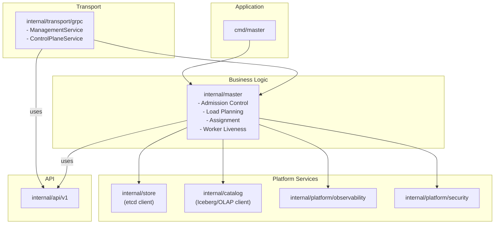

# Revised Master System Architecture: Distributed In-Memory Acceleration Layer

## 1. Guiding Principles for Revision

This architecture document presents a revised, simplified design for the Master component. The primary goals of this revision are to reduce complexity, eliminate premature generalization, and improve developer productivity by adhering to the YAGNI ("You Ain't Gonna Need It") principle.

The key changes focus on:
- **Module Consolidation:** Grouping closely related functions into more cohesive packages to reduce fragmentation and boilerplate.
- **Abstraction Simplification:** Retaining only the interfaces that provide immediate, clear value for extension or decoupling, and favoring concrete implementations for other functionalities.

## 2. Revised Module Map and Package Layout

The Master codebase is organized into a domain-oriented package structure that balances separation of concerns with low cognitive overhead. The layout distinguishes between core business logic, foundational platform services, and transport handling.

| Package Path            | Category        | Responsibility                                                                                                                                                               |
| ----------------------- | --------------- | ---------------------------------------------------------------------------------------------------------------------------------------------------------------------------- |
| `cmd/master`            | Application     | The binary entry point; responsible for initializing and running the application.                                                                                              |
| `internal/master`       | **Business Logic** | The core of the control plane. Contains the primary logic for `admission`, `assignment`, and `cluster` management (worker tracking). This package is what makes the Master a master. |
| `internal/transport/grpc` | Transport Layer | Implements the gRPC service handlers (`ManagementService`, `ControlPlaneService`), manages the server lifecycle, and handles stream management for worker communication.    |
| `internal/store`        | **Platform Service** | Provides a simplified, high-level interface over the `etcd` client for KV, lease, leader election, and transaction operations. It serves all needs related to cluster state and configuration. |
| `internal/catalog`      | **Platform Service** | Abstracts clients for interacting with external metadata sources (e.g., Iceberg catalogs). Used by the admission logic to resolve logical requests into physical data plans. |
| `internal/platform/*`   | **Platform Services** | A collection of truly generic, application-agnostic building blocks. Initially contains `observability` (metrics, logging) and `security` (mTLS, auth).                  |
| `internal/api/v1`       | API Definitions | Contains the generated Protobuf code, defining the service contracts.                                                                                                         |

### High-Level System Diagram (Revised)

## 3. Simplified Core Abstractions

This revised design significantly reduces the number of core abstractions, favoring concrete implementations until an abstraction is clearly warranted.

### Retained Abstractions (Interfaces)

1.  **`catalog.Connector`**:
    *   **Description:** An interface within the `internal/platform/catalog` package that abstracts interactions with a specific type of external metadata source. This is the primary abstraction for extending the system to new data sources.
    *   **Example Implementation:** `catalog.IcebergConnector`.
    *   **Justification:** Allows for supporting new data sources (e.g., OLAP databases) in the future by adding new implementations without changing the core admission logic in `internal/master`.

2.  **`master.AssignmentStrategy`**:
    *   **Description:** An interface within the `internal/master` package that defines how to select workers for a given `LoadPlan`.
    *   **Example Implementation:** `master.RoundRobinStrategy`, `master.CapacityAwareStrategy`.
    *   **Justification:** Placement logic is a natural point of extension and evolution. The Strategy pattern is appropriate here.

3.  **`observability.AuditLogger`**:
    *   **Description:** An interface, likely within `internal/platform/observability`, for recording critical audit events (e.g., admission, assignment, rejection).
    *   **Example Implementation:** `observability.ZapAuditLogger`.
    *   **Justification:** Auditing is a distinct, cross-cutting concern. An interface allows the backend to be changed (e.g., from a log file to a dedicated service) without impacting business logic.

### Eliminated Abstractions (Now Concrete Implementations)

-   **Leader Election:** Handled by a concrete implementation within the `internal/store` package, which wraps the `etcd` client library directly.
-   **Worker Liveness & Directory:** Managed directly within `internal/master` by using the `internal/store` to watch `etcd` leases and keys.
-   **Admission Workflow (Validation, Planning, Quotas):** These are now concrete functions/methods within the `internal/master` package, orchestrated by the gRPC handlers in `internal/transport/grpc`. The tight coupling between these steps means they do not benefit from being separated by interfaces at this stage.
-   **Worker Event Streaming (`EventSink`):** Replaced by a concrete `StreamRegistry` within the `internal/transport/grpc` package to manage active worker connections and send messages.
-   **Configuration & Quota Management:** Handled by direct calls to the `internal/store`, which reads the required data from `etcd`.

## 4. Justification for Changes

This revised architecture provides several key benefits:

1.  **Reduced Complexity & Cognitive Load:** By consolidating from over a dozen packages to a handful, the project structure is easier to understand and navigate. Developers can find related logic in one place.
2.  **Less Boilerplate:** Fewer interfaces and components mean less code dedicated to dependency injection, constructors, and mocks for testing.
3.  **Improved Traceability:** The flow of control, especially during the critical admission process, is more direct and easier to follow without jumping through multiple layers of abstraction.
4.  **Pragmatism (YAGNI):** The design focuses on solving today's problems with the simplest effective solution. It avoids building a complex "platform" for hypothetical future needs, while still leaving clear extension points (`Connector`, `AssignmentStrategy`) where they are most likely to be needed.